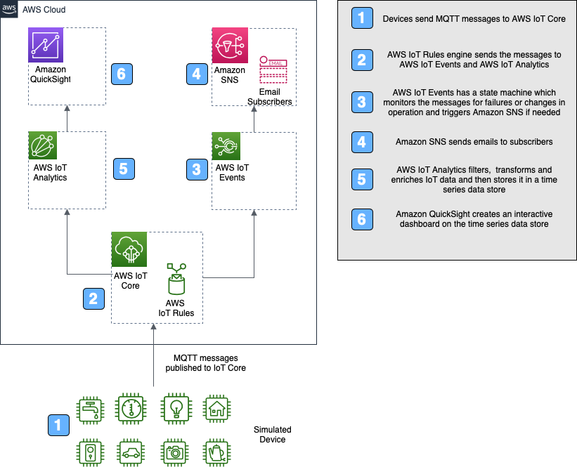

# Extract, Analyze, and Notify

This IoT Events accelerator demonstrates how to *extract* data from a local device, *analyze* on the cloud, and *notify* (EAN) using a SNS notification system.

Common use cases for EAN include:

- Receiving data from sensors.
- Looking for data pattern.
- If the last 5 consecutive data are greater than 1023 (sensor range is 0-4095), notify user via SNS.
- If device does not send data for 120 seconds, notify user via SNS.
- Wait atleast 120 seconds before sending next error.
- Store data on IoT Analytics, so we can analyze sensor performance using QuickSight.

## EAN Accelerator Use Case

Imagine we have equipment in the lab that we want to monitor for performance. We can load the data to the cloud and use IoT Events to quickly monitor for abnormal performance. If abnormal perfomance is detected (5 consecutive bad data), an SNS message is sent. If the device does not send data for 120 seconds, notify user vis SNS.

Finally, individual records are stored in IoT Analytics with a time stamp so that we can analyze the dataset using QuickSight.

The design is composed of two main parts:

* The source - A sensor that generates random data between 0 and 4096 (12 bits). This is implemented as a docker container on the local computer.
* AWS Cloud - The destination for the data - AWS IoT topics routes the data to AWS IoT Events for decision making and SNS notification on bad events or no data received and AWS IoT Analytics for storage and analysis using QuickSight.



The  processing flow of the accelerator is:

1. **Extract** - This data is sent from the IoT device to the cloud using MQTT. The IoT Thing created and registered on the cloud receives the data. The data is routed via IoT Rules to the IoT Events and IoT Analytics.

2. **Analyze** - The data analysis is done in the Detector Model of IoT Events. The Detector Model has a state machine which looks for 5 consecutive data out of range. Once the data starts coming in to the Detector Model, a timer is started to monitor the frequency of data coming in. The data is also sent with time stamp to IoT Analytics which can be analyzed using QuickSight.

3. **Notify** - The detector model in IoTEvents is connected to SNS. A SNS notification is sent to subscribers if  there is a error condition (5 consecutive bad data or no new data for 120 seconds).

## Design Pattern

The entire extract and analysis is done utilizing AWS IoT components. IoT Thing with a valid certificate is created which receives data using MQTT connection from a device. The data is routed to IoT Events using IoT Rules. The IoT Events has a state machine which performs a logical check on the incoming data. On Error, a SNS notification is sent to the registered subscribers. IoT Rules is also used to route data to IoT Analytics where the data is saved for future anaysis using QuickSight.


## Folder Structure

```text
extract_analyze_notify/
├── README.md                          <-- This file!
├── cfn
│   ├── ean_accelerator-INPUT.cfn.yaml <-- CloudFormation template
│   └── lambda_functions
├── docker
│   ├── certs
│   ├── Dockerfile-iotcore
│   ├── docker-compose.yml
│   ├── iotcore-accel.sh
│   ├── simulated_device.py
├── docs

```

There are two main components to using the accelerator. The `cfn/` directory contains the CloudFormation assets to create the IoT Core Accelerator on the Cloud. The cloud deployment then waits for the target system, in this case a docker container, to start.

The `docker/` directory contains the assets to create a Docker image and running container with python scripts to send randomized device data.

## How to Deploy the Accelerator

To launch this accelerator, there are a few prerequisites and steps to complete. It is assumed you have basic experience with AWS IoT via the console and CLI.

The main steps for deployment are:

1. *Complete prerequisites*. Ensure there is an AWS IoT certificate and private key created and accessible locally for use.
2. *Generate and launch the CloudFormation stack*. This will create the AWS IoT thing, AWS IoT events and AWS IoT Analytics to analyze data and notify via SNS if needed.
3. *Run the container*. Launch (`docker-compose --build up`) to build the container, which will start sending random device data.

When finished, stopping the accelerator (`CTRL-C` followed by `docker-compose down`) will gracefully stop all containers and then remove then. The deployment state and any persisted data will be preserved in the `docker/` subdirectories, and used when restarted.

### Verify Prerequisites

The following is a list of prerequisites to deploy the accelerator:

* AWS Cloud
  * Ensure you have an AWS user account with permissions to manage `iot`, `iotevents`, `lambda`, `cloudwatch`, and other services during the deployment of the CloudFormation stack.
  * Create an AWS IoT Certificate and ensure it is activated and the certificate and private key files are saved locally. This certificate will be associated with an AWS IoT *thing* created by the CloudFormation stack. Copy the certificates *Certificate ARN*, which will be used as a parameter for the CloudFormation stack. The *Certificate ARN* will look similar to this: `arn:aws:iot:REGION:ACCOUNTNAME:cert/27b42xxxxxxx120017a`.
  * Create an S3 bucket *in the same region where CloudFormation resources will be created* to hold the packaged files. Please see [this link](https://docs.aws.amazon.com/AWSCloudFormation/latest/UserGuide/using-cfn-cli-package.html) for more details.
* Local Environment (where running the accelerator)
  * Verify Docker Desktop or Docker Machine installed, and you have the ability to create or download images locally and run containers.
  * From the certificate creation step above, note the location of the X.509 certificate and private key registered and activated with AWS IoT.
  * Ensure a recent version of the AWS CLI is installed and a user profile with permissions mentioned above is available for use.

### Launch the CloudFormation Stack

Prior to launching the accelerator, a CloudFormation package needs to be created, and then the CloudFormation stack launched from the Template. Follow the steps below to create the package via the command line, and then launch the stack via the CLI or AWS Console.

The CloudFormation template does most of the heavy lifting. Prior to running, each *input* template needs to be processed to an *output* template that is actually used. The package process uploads the Lambda functions to the S3 bucket and creates the output template with unique references to the uploaded assets. 

To create or overwrite the templates, perform the following steps from a command line or terminal session:

1. Clone the repository `git clone https://github.com/awslabs/aws-iot-core-accelerators.git` and change to `aws-iot-core-accelerators/accelerators/extract_analyze_notify/cfn`, where this README.md file is located.

1. Create the CloudFormation output file using the AWS CLI.  Using the commands below, you can either preset the \$AWS_PROFILE, \$REGION, and \$S3_BUCKET variables, or reference those directly via the `aws cloudformation package` command. The result of that command will be an *OUTPUT* CloudFormation template file, along with the packaged Lambda functions being copied to the S3 bucket. The `AWS_PROFILE` contains the credentials, account details, and optionally region to create the CloudFormation stack.

   Complete list of commands to create the CloudFormation template file, upload assets, and create a stack (note the changes for the `--parameter-overrides` section).
   
   ```bash
   # BASH commands (replace exports with your AWSCLI profile, region, and S3 bucket settings)
   # AWS_PROFILE contains permissions to fully create and launch the CloudFormation package and template
   export AWS_PROFILE=your-profile-here
   export REGION=us-west-2
   export S3_BUCKET=your_s3_bucket_here         # Needs to be located in same region as where the CloudFormation stack is created.
                                                
   #Setup the region is aws configure to be the same as the one set above. This can be done by typing. The region here should be the same as above
   aws configure 
   and selecting the region
   
   # Create keys and certificate and save the keys and certificate arn. The certificate arn is the first output
   aws iot create-keys-and-certificate \
     --set-as-active \
     --certificate-pem-outfile "certificate.pem" \
     --public-key-outfile "publicKey.pem" \
     --private-key-outfile "privateKey.pem"
   
   # Clean up any previously created files
   rm *-OUTPUT.yaml
   aws cloudformation package --template-file ean_accelerator-INPUT.cfn.yaml --output-template-file ean_accelerator-OUTPUT.yaml --s3-bucket $S3_BUCKET --profile $AWS_PROFILE --region $REGION
     
   # If using the AWS Console, upload the ean_accelerator-OUTPUT.yaml and continue with the parameters.
   # Below are the steps to deploy via the command line.
     
   # To deploy back-end stack from CLI (change --stack-name and --parameter-overrides to expected values)
   aws cloudformation deploy \
     --region $REGION \
     --stack-name iot-core-accelerator \
     --template ean_accelerator-OUTPUT.yaml \
     --capabilities CAPABILITY_NAMED_IAM\
     --parameter-overrides \
     CertificateArn="certificate ARN from prerequisites"  \
     SNSEmail="email to send SNS to" \
     ThingName="IoTCoreAccelThing"
   
   # Output of stack deploy command:
   Waiting for changeset to be created..
   Waiting for stack create/update to complete
   Successfully created/updated stack - iot-core-accelerator
   ```

At this point, all resources have been created.

You will get an AWS Notification - Subscription Confirmation email to the email address specified in the deployed step. Confirm the subscription if you would like nofications. 

### Configure and Launch the Docker Container

With the stack deployed, we use the certificate and private key to complete the docker deployment that simulates a device.

1. Change to the the `docker/` directory.

2. Copy over the certificate and private key files to the `certs` directory. 

3. Change the region.txt in the `certs` directory to reflect the region where the certificate was created and the cfn has been deployed.

At this point, the Docker configuration has the details needed to start the containers and create a device to connecy to AWS IoT Core using MQTT. Using `docker-compose` in the foreground, verify that the containers start and you are receiving startup log entries:

:exclamation: The first build may take a long time to complete as it installs dependencies. Further runs will use the locally created image so startup time will be shortened.

```bash
$ docker-compose up --build
Building iotcore
Step 1/9 : FROM python 2.7
...
Successfully tagged x86_64/simulateddevice-ean:latest
Creating ean-simulateddevice ... done
Attaching to ean-simulateddevice
ean-simulateddevice | Installing AWS SDK
ean-simulateddevice | Cloning into 'aws-iot-device-sdk-python'...
```
To verify operation, you can look at the iotcore_accel_data_dataset for data being stored in IoT Analytics.

One easy way to simulate errors is to stop the docker container for 2 or more minutes using the command: (`CTRL-C` followed by `docker-compose down`)

### Visualizing the Data

The data can be visualized by using Quicksight easily. Open the QuickSight dashboard in the same region we have run the cloud formation. 
  Click on Manage data
  Click on New data set
  Pick AWS IoT Analytics
  Pick iotcore_accel_data_dataset
  Click Create data source
  Click Visualize


